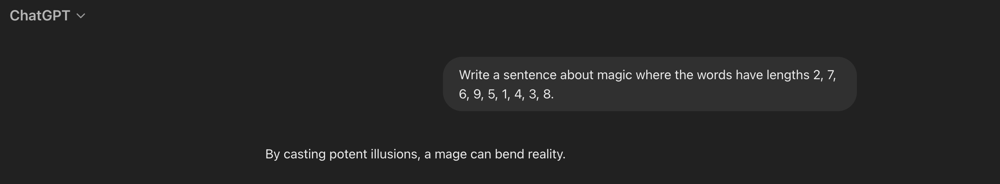
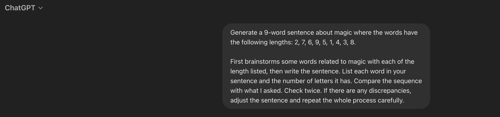

# EPFL, CIVIL-127
Programming and software development for engineers
---
layout: center
---
# Teachers

- Prof. Alexandre Alahi
- Alok Menghrajani (<small>unfortunately, absent today</small>)
---

# Questions, comments, feedback:

<v-clicks>

- Forum
- alok.menghrajani@epfl.ch or alexandre.alahi@epfl.ch
- Teaching Assistants

<!--

This is the first time we are doing this course. We are very interested
to hear from you.

-->

</v-clicks>
---
layout: center
---

# Purpose of this course

<!--

We aren't trying to turn you into software engineers.

But we want to enable you to best collaborate with software engineers. You
might also need to write or read some amount of code in your career.

-->

---

# Course content

<v-clicks>

- Tools used by software engineers
- Python
- Software engineering techniques

</v-clicks>

<!--

The tools we'll be using include an IDE and git.

Python will repeat some of the knowledge you already know, to make sure
you have solid foundations. We'll also explore more features of the language.

You'll learn software engineering techniques as practiced in the industry.
We'll discuss best practices, such as how to comment your code, how
to test it, etc.

-->

---

# Learning objectives

<v-clicks>

- Apply industry-standard best practices in Python programming.
- Develop clean, testable, and easily reviewable code.
- Test, debug, and fix bugs in a systematic and efficient manner.

</v-clicks>

<!--

This is described in your coursebook.

-->

---

# Organization

- 45min weekly lectures
- 1h30 weekly labs
- ~3h weekly homework
- 12 sessions in a semester

<!--

12 lectures + 12 labs, not counting the midterm and enac week.

-->

---

# Grading and due dates

<v-clicks>

- 4th lab is graded (due on March 14th, 2025)
- 6th lab can earn you a bonus (due on March 28th, 2025)
- MCQ mid-term (on April 15th, 2025)
- Project (due on May 23rd, 2025)

</v-clicks>

<!--

These dates are set in stone. For the labs and projects, we have already
added a couple days so please make sure you submit your work on time.

-->

---

# Today's AI tools

<v-clicks>

- You are allowed to use them...
- ...our recommendation: first try to solve programming assignments without
  any AI tool and then see if or how an AI tool would have helped.

</v-clicks>

<!--
We can't detect these tools, so we can't ban them.

Think about calculators in middle school. You don't learn basic
addition and multiplication using calculators. But once you know the basics,
you can use calculators to save time.

You should have the same approach with AI tools. They can speed you up but
do make sure that you have first obtained the underlying knowledge.
-->

---

# Today's AI tools

<v-clicks>

- Sometimes wrong
- Sometimes wrong in subtle ways
- Writing good prompts is a skill
- Can be a time sink

</v-clicks>

<!--

when the tool is wrong, you need to be able to notice that it's wrong.
the current tools don't have context on which python version you are using
and which library versions you have. During the training phase, they don't
know which python version a given snippet of code is for. So they make
subtle mistakes.

-->

---
layout: center
---



<!--
this is an example using 4o model, from Feb 2025. These tools will become
better, but I'm showing you the current state of things.
-->

---
layout: center
---



---
layout: center
---


---
layout: center
---

> “I lost about an hour today because Cursor very confidently led me down a refactoring path based on a completely hallucinated (but reasonable-seeming!) understanding of json serialization in python.” 

<div style="text-align: right"><small>&mdash; Senior engineer on Jan 8th, 2025</small></div>

---
layout: center
---

# Tomorrow's AI tools

<center>???</center>

<!--

What will tomorrow's AI tools look like? Will software engineering
go away? Significantly change?

We hope we are teaching you a life skill and that tomorrow's AI tools
won't deprecate this class' content.

-->

---

# Learn by watching

- Read other people's code
- Watch other people write code
- Watch other people debug an issue

<!--

Learn by watching how people go from idea to code. How they
organize the code, how they iterate in their IDE, are they using
"fancy" keyboard shortcuts or tools, etc.

-->

---

# Learn by doing

- Labs and projects
- Optional additional programming assignments

<!--

We want you to write a lot of code. That's how you'll get practice
and become proficient.

-->

---

# Install Visual Studio Code and Python

- Make sure you have the correct Python version
- The first lab will help ensure your environment is setup correctly

<!--
Get help from the TAs if you are unable to install Visual Studio Code or
the correct python version.
-->

---
layout: two-cols
---
# Sokoban


<small>image by Carloseow<br>from https://en.wikipedia.org/wiki/Sokoban</small>

::right::

# &nbsp;

- Puzzle game
- Implementation over first 6 labs
- We'll use pygame to build the graphical user interface

---
layout: center
---

# Python

<!-- 

We are now going to go over some Python things that you'll need for the
first lab.

-->

---

# Whitespace

<p>Remember, in Python, whitespaces are important! They define each block's
scope.</p>

<<< whitespaces1.py py

<div v-click>

<p>Result</p>

<<< whitespaces1.out txt

</div>

---

# Whitespace

<p>Remember, in Python, whitespaces are important! They define each block's
scope.</p>

<<< whitespaces2.py py

<div v-click>

<p>Result</p>

```
```

</div>

---

# For loops

<<< iteration.py py

<div v-click>

<p>Result:</p>

<<< iteration.out txt {lines: false}

</div>

---

# For loops

<<< iteration1.py py

<div v-click>

<p>Result:</p>

<<< iteration1.out txt {lines: false}

</div>

---

# For loops

<<< iteration2.py py

<div v-click>

<p>Result:</p>

<<< iteration2.out txt {lines: false}

</div>

---

# For loops

<<< iteration3.py py

<div v-click>

<p>Result:</p>

<<< iteration3.out txt {lines: false}

</div>

---

# For loops

<<< iteration4.py py

<div v-click>

<p>Result:</p>

```
```

</div>

---

# For loops

<<< iteration5.py py {3|5|*}

<div v-click>

<p>Result:</p>

<<< iteration5.out txt {lines: false}

</div>

---

# Strings

<v-clicks>

- <code>"Hello Joe"</code> _double quotes_
- <code>'Hello Joe'</code> _single quote_
- <code>"Hello " + "Joe"</code> _concatenation_
- <code>"Hello {}".format("Joe")</code> _String's <code>[format()](https://docs.python.org/3.12/library/stdtypes.html#str.format)</code> method_
- <code>"Hello {name}".format(name="Joe")</code> _<code>[format()](https://docs.python.org/3.12/library/stdtypes.html#str.format)</code> method with names_
- <code>"Hello%s" % "Joe"</code> _printf-style_

</v-clicks>

<!--
There are so many ways to create strings. Which one do you like best?

This slide doesn't even cover all the methods, there's more such as
r-strings, `"""`, `'''`, etc.
-->

---

# User input

<small>[input()](https://docs.python.org/3.12/library/functions.html#input) is a built-in function</small>

<<< input.py py {1|2|*}

<v-switch>
<template #0>
<p>Result:</p>

<<< input-1.out txt {*}{lines: false}
</template>
<template #1>
<p>Result:</p>

<<< input-2.out txt {*}{lines: false}
</template>
<template #2>
<p>Result:</p>

<<< input-3.out txt {*}{lines: false}
</template>
</v-switch>

<!--
input() is terminal function

The program pauses and waits for user input. The program
resumes once you hit enter.
-->

---

# Reading data from a file

<<< read_file.py py {1|2|3|*}

<div v-click>

<p>Result:</p>

<<< read_file.out txt {*}{lines: false}

</div>

---

# Lists

<small>see [Lists](https://docs.python.org/3.12/library/stdtypes.html#list), [Common Sequence Operations](https://docs.python.org/3.12/library/stdtypes.html#typesseq-common), and [Mutable Sequence Types](https://docs.python.org/3.12/library/stdtypes.html#typesseq-mutable)</small>

<<< list.py py {*|1|3|4|5|7|*}

<div v-click>
<p>Result:</p>
<<< list.out txt {*}{lines: false}
</div>

<!--

Lists are 0-indexed.
You can create lists of a specific length by using the '*' operator.

-->

---

# Tuples

- Tuples are immutable lists
- Subset of lists API

<<< tuple.py py {1|2|3|4|5|6|7|*}

<div v-click>
<p>Result:</p>
<<< tuple.out txt {*}{lines: false}
</div>

<!--

Think of tuples as a list for now. You can take the
0th or 1st element. You can unpack elements. You can call len() on it.

-->

---

# Dictionnaries

<v-clicks>

  - <code>dict()</code> or <code>{}</code>
  - key-value data structure
  - <code>d = {"foo": 123, "bar": 567}</code>
  - iteration order is guaranteed to be insertion-order
  - keys can be anything (int, tuple, strings, etc.)

</v-clicks>

---

# Dictionnaries

<<< dictionnaries1.py py

<div v-click>

<p>Result:</p>

<<< dictionnaries1.out txt {lines: false}

</div>

---

# Dictionnaries

<<< dictionnaries2.py py

<div v-click>

<p>Result:</p>

<<< dictionnaries2.out txt {lines: false}

</div>

---

# Dictionnaries

<<< dictionnaries3.py py

<div v-click>

<p>Result:</p>

<<< dictionnaries3.out txt {lines: false}

</div>

---

# List comprehension

<<< list_comprehension.py py {1|*}

<div v-click>
<p>Result:</p>
<<< list_comprehension.out txt {*}{lines: false}
</div>

---

# List comprehension

<p>Equivalent</p>
<<< list_comprehension2.py py {1-3|*}

<div v-click>
<p>Result:</p>
<<< list_comprehension2.out txt {*}{lines: false}
</div>

---

# 2D arrays: plain list

<<< 2d_grid_1.py py {*|1|2|9-10|4-7|5-6|7|12-13|15-19|21|22|23|*}

<!--

We can use a 1D list to store a 2D grid. This is very efficient, if the
HEIGHT is a power of 2, the offset computation is very efficient.

-->

---

# 2D arrays: plain list

<p>Result:</p>
<<< 2d_grid_1.out txt {*}{lines: false}

<!--

We get the expected result. 'A' in a corner and 'B' towards the other side.

-->

---

# 2D arrays: list of lists

<<< 2d_grid_2a.py py

<div v-click>
<p>Result:</p>
<<< 2d_grid_2a.out txt {*}{lines: false}
</div>

<!--

We can also represent 2D arrays using a list of lists.

You might think it's ok to create a list of lists in this way. And you
do get a list of lists.

-->

---

# 2D arrays: list of lists

<<< 2d_grid_2.py py {2|4-5|7-8|16|17|*}

<p>Don't do this! ⚠️</p>

<!-- It is however not correct! -->

---

# 2D arrays: list of lists

<p>Result:</p>
<<< 2d_grid_2.out txt {*}{lines: false}

<p>We have an incorrect behavior.</p>

<!-- Can you explain what's going on? You'll understand later...
-->

---

# 2D arrays: list of lists

<<< 2d_grid_3.py py {2|16-17|*}

<!--

This is a correct way to create lists of lists. We use list comprehension
to avoid aliasing data. _ is used to indicate that the variable is
never used.

-->

---

# 2D arrays: list of lists

<p>Result:</p>
<<< 2d_grid_3.out txt {*}{lines: false}

---

# 2D arrays: dict

<<< 2d_grid_4.py py {2|9-10|5-6|7|18-19|*}

<!--

Just because we have a 2D dataset doesn't mean we are forced to store the
data in a grid. We can use a dict! -->

---

# 2D arrays: dict

<p>Result:</p>

<<< 2d_grid_4.out txt {*}{lines: false}

---

# pip install &lt;package&gt;

- Do leverage existing libraries

<!--

We want to strike a balance between re-inventing the wheel and
learning the basics. Feel free to leverage existing libraries.

Be careful, a malicious library can access and/or delete all the data
on your computer!

How can you tell if a library is high quality? Bug free? Well
maintained? => github stars is one signal.

-->

---

# Popular packages

<v-clicks depth="2">

- https://docs.python.org/3.12/library/index.html
  - [pprint](https://docs.python.org/3/library/pprint.html)
  - [itertools](https://docs.python.org/3/library/itertools.html)
  - [functools](https://docs.python.org/3/library/functools.html)
  - [datetime](https://docs.python.org/3/library/datetime.html)
  - [colorful](https://pypi.org/project/colorful/) and [colorama](https://pypi.org/project/colorama/)
  - ...
- [numpy](https://pypi.org/project/numpy/)
- [scipy](https://pypi.org/project/scipy/)
- ...

</v-clicks>
