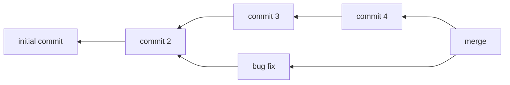
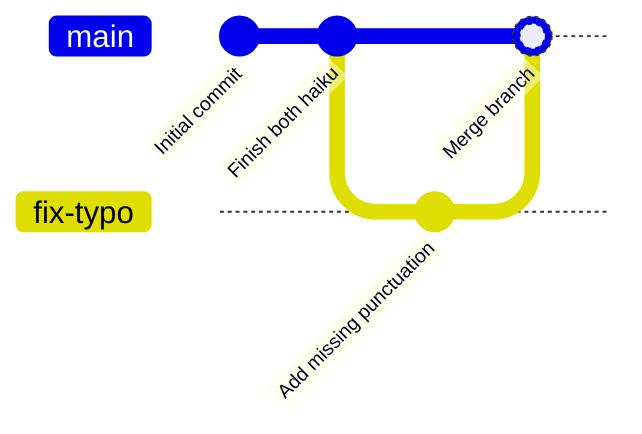

# EPFL, CIVIL-127
Programming and software development for engineers

---
layout: center
---

# 👋 Hello

<!--

Hi everyone, my name is Alok Menghrajani. You can call me Mr Menghrajani or by
my firstname. I’m an external lecturer. I studied at EPFL and I have spent 20
years in the industry. I developed software for various startups and financial
institutions. I am not a formally trained teacher nor academic. I do have
experience coaching people on technical matters, from interns to CTOs. I’m here
to share my experience working in the industry and hopefully help you become
stronger engineers. I am here to help you. Please ask questions via the forum.
I hope you will enjoy this course and again I’m always open to feedback and
improving!

-->

---

# Questions, comments, feedback:

<v-clicks depth="2">

- [Forum](https://moodle.epfl.ch/mod/forum/view.php?id=1324494)
- alok.menghrajani@epfl.ch or alexandre.alahi@epfl.ch
- Teaching Assistants
  - Valentin and Weijiang
- Student Assistants
  - Johanna and Mehdi

</v-clicks>

<!--

This is the first time we are doing this course. We are very interested
to hear from you.

-->

---

# 2D arrays: plain list

<<< 2d_grid_1.py py {*|1|2|9-10|4-7|5-6|7|12-13|15-19|21|22|23|*}

<!--

We can use a 1D list to store a 2D grid. This is very efficient, if the
HEIGHT is a power of 2, the offset computation is very efficient.

-->

---

# 2D arrays: plain list

<p>Result:</p>
<<< 2d_grid_1.out txt {*}{lines: false}

<!--

We get the expected result. 'A' in a corner and 'B' towards the other side.

-->

---

# 2D arrays: list of lists

<<< 2d_grid_2a.py py

<div v-click>
<p>Result:</p>
<<< 2d_grid_2a.out txt {*}{lines: false}
</div>

<!--

We can also represent 2D arrays using a list of lists.

You might think it's ok to create a list of lists in this way. And you
do get a list of lists.

-->

---

# 2D arrays: list of lists

<<< 2d_grid_2.py py {2|4-5|7-8|16|17|*}

<p>Don't do this! ⚠️</p>

<!-- It is however not correct! -->

---

# 2D arrays: list of lists

<p>Result:</p>
<<< 2d_grid_2.out txt {*}{lines: false}

<p>We have an incorrect behavior.</p>

<!-- Can you explain what's going on? You'll understand later...
-->

---

# 2D arrays: list of lists

<<< 2d_grid_3.py py {2|16-17|*}

<!--

This is a correct way to create lists of lists. We use list comprehension
to avoid aliasing data. _ is used to indicate that the variable is
never used.

-->

---

# 2D arrays: list of lists

<p>Result:</p>
<<< 2d_grid_3.out txt {*}{lines: false}

---

# 2D arrays: dict

<<< 2d_grid_4.py py {2|9-10|5-6|7|18-19|*}

<!--

Just because we have a 2D dataset doesn't mean we are forced to store the
data in a grid. We can use a dict! -->

---

# 2D arrays: dict

<p>Result:</p>

<<< 2d_grid_4.out txt {*}{lines: false}

---

# pip install &lt;package&gt;

<v-clicks depth="2">

- Do leverage existing libraries
- https://docs.python.org/3.12/library/index.html
  - [pprint](https://docs.python.org/3/library/pprint.html)
  - [itertools](https://docs.python.org/3/library/itertools.html)
  - [functools](https://docs.python.org/3/library/functools.html)
  - [datetime](https://docs.python.org/3/library/datetime.html)
  - ...
- [colorful](https://pypi.org/project/colorful/) and [colorama](https://pypi.org/project/colorama/)
- [numpy](https://pypi.org/project/numpy/)
- [scipy](https://pypi.org/project/scipy/)
- ...

</v-clicks>

<!--

We want to strike a balance between re-inventing the wheel and
learning the basics. Feel free to leverage existing libraries.

Be careful, a malicious library can access and/or delete all the data
on your computer!

How can you tell if a library is high quality? Bug free? Well
maintained? => github stars is one signal.

-->

---
layout: center
---

# git

<!--

Today's session is going to talk about git. Git is a tool used by the majority
of people writing software. I'm going to teach you how the tool works at
a high level and today's lab will go over some git commands. Git is a complex tool,
and it takes a bit of time to get used to it. To be frank, it's a great tool
with an extremly poor user interface. If you need additional resources, there
are free books and tutorials.

Again, we'll go over the basics, we won't cover all the features in this class.
If there's something you feel is missing, please let me know.

-->

---

# git ≠ GitHub

<v-clicks>

- git
  - open source
  - command line tool
  - 3rd party graphical interfaces
- GitHub
  - Owned by Microsoft
  - Collaboration tool, builds on top of git
  - Loads of features (pull requests, issue tracking, forums, wiki, pages, CI/CD, etc.)

</v-clicks>

<!--

git and GitHub are two different but closely related things.

Git is a source control tool. There are also alternatives to git, but git
dominates the industry. Most people use git with GitHub, but you can use
it with other tools or by itself. For example, the Linux kernel is coordinated
using git and mailing lists: developers send patches to each other via email!

The command line tool is important to know. There are GUI tools that will
replace the need to know the command line tool, but I believe it's
productive to know how the CLI work. It helps you better understand the
GUI versions of the tools.

Even though there are alternatives to GitHub, it's pretty much the defacto
standard in the industry today and GitHub works with git. IMHO, GitHub
therefore played a role in making git so popular.

For this class, you will not need to create a GitHub account. You can if you
wish to, and you can then store your code on GitHub, either in a private
or a public repo. For example, this course slides are on GitHub, and if you
find mistakes, you can suggest improvements.

-->

---

# What is git?

<v-clicks>

- distributed version control system
- enables collaboration
- enables iterative changes and rollbacks
- resolves conflicts

</v-clicks>

<!-- 

distributed == each developer has their own copy of the main code +
all the branches and tags. You can work offline and only need to connect
to a network to share your work.

git doesn't need a central server. But in practice, everyone is hosting
their code on GitHub. I.e. we could use a centralized system and most projects
would work pretty much the same way.

version control == it's like google docs. You can see a file's change history.
Version control is important, it means you can safely make changes to files
and revert the changes if they turn out not to be a good idea. Software
is typically implemented in small increments, version control lets you
manage these increments. Git lets you share and backup your code with
any number of remote git servers.

conflict resolution == if two developers make changes to the same file
at the same time, git will be able to either automatically merge the
two changes or notify one of the developers that their change conflicts.
The developer will then be able to resolve the conflict manually.

-->

---

# Resources

- git man pages
- Pro Git (free book): https://git-scm.com/book/en/v2
- Lots of free resources and tutorials

<!--

Use the book and tutorials. Keep in mind that there are sometimes different
ways to do the same thing in git, and that's ok.

There's a ton of resources on git! If you don't like the above suggestions,
I can suggestion at least 6 other resources.

- https://git-scm.com/docs/gittutorial
- https://git-scm.com/docs/gittutorial-2
- https://git-scm.com/docs/giteveryday
- https://www.atlassian.com/git/tutorials
- https://training.github.com/downloads/github-git-cheat-sheet.pdf
- https://docs.github.com/en/get-started/using-git/about-git
- https://ftp.newartisans.com/pub/git.from.bottom.up.pdf
-->

---

# Creating a repo

```ansi {1-2|3|4|*}
$ mkdir my-first-git-repo
$ cd my-first-git-repo
[my-first-git-repo]$ git init
Initialized empty Git repository in /[...]/my-first-git-repo/.git/
```

<!--
git stores metadata in the .git/ folder. Do not mess around with this folder.

git works at the file level. It doesn't understand or care about whether your
code is Python or something else. In general, you should only store human
readable data (html, text, source code, small images, etc.) in git -- it's not
designed for storing large binary data.

A repo contains all the commit history, branches and tags. We'll learn about
branches and tags in a bit.

Instead of git init, you can also use git clone <url> to clone an existing
repo.
-->

---

# <u>working directory</u> vs <u>staging area</u> vs <u>tree</u>

<v-clicks>

- working directory &rarr; files on your disk
- staging area &rarr; changes you want to include in your next commit
- tree &rarr; store of all the commits

</v-clicks>

<!--
working directory: git does not look at the working directory unless
told! Just because a file exists in the working directory does not mean
that git will track it.

staging area: how git knows what to include in the next commit

tree: a history of commits

Right now, we created an empty git repo. We therefore have a
empty working directory, an empty staging area and an empty tree.

The git workflow is:
edit, add, commit
-->

---

# An initial file

```ansi {1|2-3|4-13|*}
[my-first-git-repo]$ echo "Code flows like rivers of change," > haiku.txt
[my-first-git-repo]$ ls
haiku.txt
[my-first-git-repo]$ git status
On branch main

No commits yet

Untracked files:
  (use "git add <file>..." to include in what will be committed)
	haiku.txt

nothing added to commit but untracked files present (use "git add" to track)
```

<!--
We created a file. Our working directory has changed. The staging area
is still empty. `git status` tells us that we have an untracked file.
-->

---

# Staging

```ansi {1|2-9|*}
[my-first-git-repo]$ git add haiku.txt
[my-first-git-repo]$ git status
On branch main

No commits yet

Changes to be committed:
  (use "git rm --cached <file>..." to unstage)
	new file:   haiku.txt
```

---

# Initial commit

<v-switch>

<template #0>

```ansi
[my-first-git-repo]$ git commit
```

</template>

<template #1>

```txt
█
# Please enter the commit message for your changes. Lines starting
# with '#' will be ignored, and an empty message aborts the commit.
#
# On branch main
#
# Initial commit
#
# Changes to be committed:
#       new file:   haiku.txt
#
```

</template>

<template #3>

```txt
Initial commit█
# Please enter the commit message for your changes. Lines starting
# with '#' will be ignored, and an empty message aborts the commit.
#
# On branch main
#
# Initial commit
#
# Changes to be committed:
#       new file:   haiku.txt
#
```

</template>
</v-switch>

<!--

when creating a commit, git opens your editor. For me, it's vim. You
can configure another tool if you don't know vim.

Your hash is going to be different, since the hash includes the creation
date and the author.
-->

---

# Initial commit

```ansi {1-4|5-6|7-9|10-15|*}
[my-first-git-repo]$ git commit
[main (root-commit) 17d2441] Initial commit
 1 file changed, 1 insertion(+)
 create mode 100644 haiku.txt
[my-first-git-repo]$ ls
haiku.txt
[my-first-git-repo]$ git status
On branch main
nothing to commit, working tree clean
[my-first-git-repo]$ git log
commit 17d2441d2c49913d9f022dd49f727f70010ce0c1 (HEAD -> main)
Author: Alok Menghrajani <441307+alokmenghrajani@users.noreply.github.com>
Date:   Fri Feb 7 10:42:24 2025 +0100

    Initial commit
```

<!-- 
git commit shows that one file changed and 1 line was added.
ls shows that our file is still on our file system.
git status shows that the staging area is now clean.
git log shows our first commit. Again, your hash will differ.
-->

---

# git hashes

- Every object in the tree is identified by a hash
- An object's hash is (conceptually):<br/>
<code>hash(diff + parent hashes + commit message, author, time, ...)></code><br/>
  - where <code>hash()</code> is a one way function
  - and diff is the content change
- git is fast at showing you the state of the repo for a given hash or
computing the delta between two hashes.

---

# Making changes

```ansi {1-2|3|4-15|16-24|*}
[my-first-git-repo]$ echo "Branches diverge, merge," >> haiku.txt
[my-first-git-repo]$ echo "History preserved" >> haiku.txt
[my-first-git-repo]$ echo "Moonlight dances on the soft clouds" > haiku2.txt
[my-first-git-repo]$ git status
On branch main
Changes not staged for commit:
  (use "git add <file>..." to update what will be committed)
  (use "git restore <file>..." to discard changes in working directory)
	modified:   haiku.txt

Untracked files:
  (use "git add <file>..." to include in what will be committed)
	haiku2.txt

no changes added to commit (use "git add" and/or "git commit -a")
[my-first-git-repo]$ git diff
diff --git a/haiku.txt b/haiku.txt
index bd34e77..e95b648 100644
--- a/haiku.txt
+++ b/haiku.txt
@@ -1 +1,3 @@
 Code flows like rivers of change,
+Branches diverge, merge,
+History preserved
```

<!--

now we can use git diff to see the delta between our file system
and the staging area. Git diff computes a "patch", the minimal set of
changes.

note: git diff shows the difference between your file system and the staging
area but doesn't include newly added file. Maybe it should?

-->

---

# Making changes

```ansi {1-2|3-6|7-18|*}
[my-first-git-repo]$ git add haiku.txt
[my-first-git-repo]$ git add haiku2.txt
[my-first-git-repo]$ git commit -m 'Finish both haiku'
[main 9cc0f57] Finish both haiku
 2 files changed, 3 insertions(+)
 create mode 100644 haiku2.txt
[my-first-git-repo]$ git log
commit 9cc0f57593d59a1e8faec42e6be10be8b3fd6c2c (HEAD -> main)
Author: Alok Menghrajani <441307+alokmenghrajani@users.noreply.github.com>
Date:   Sat Feb 8 15:35:38 2025 +0100

    Finish both haiku

commit 17d2441d2c49913d9f022dd49f727f70010ce0c1
Author: Alok Menghrajani <441307+alokmenghrajani@users.noreply.github.com>
Date:   Fri Feb 7 10:42:24 2025 +0100

    Initial commit
```

---

# git log --oneline

```ansi
[my-first-git-repo]$ git log --oneline
9cc0f57 (HEAD -> main) Finish both haiku
17d2441 Initial commit
```

<!-- 

git log --oneline gives you a shorter history view. You can customize
the output of git commands to better fit your needs.

-->

---

# git log &lt;filename&gt;

```ansi
[my-first-git-repo]$ git log haiku2.txt
commit 9cc0f57593d59a1e8faec42e6be10be8b3fd6c2c (HEAD -> main)
Author: Alok Menghrajani <441307+alokmenghrajani@users.noreply.github.com>
Date:   Sat Feb 8 15:35:38 2025 +0100

    Finish both haiku
```

<!--

git log <filename> lets you see the history for a given file.

-->

---

# git blame

```ansi
[my-first-git-repo]$ git blame haiku.txt
^17d2441 (Alok Menghrajani 2025-02-07 10:42:24 +0100 1) Code flows like rivers of change,
9cc0f575 (Alok Menghrajani 2025-02-08 15:35:38 +0100 2) Branches diverge, merge,
9cc0f575 (Alok Menghrajani 2025-02-08 15:35:38 +0100 3) History preserved
```

<!--
git blame shows who authored each line of code and which commit introduced
the change. This is very useful when debugging on a large project.
-->

---

# git show &lt;ref&gt;

```ansi
[my-first-git-repo]$ git show 17d2441d2c49913d9f022dd49f727f70010ce0c1
commit 17d2441d2c49913d9f022dd49f727f70010ce0c1
Author: Alok Menghrajani <441307+alokmenghrajani@users.noreply.github.com>
Date:   Fri Feb 7 10:42:24 2025 +0100

    Initial commit

diff --git a/haiku.txt b/haiku.txt
new file mode 100644
index 0000000..bd34e77
--- /dev/null
+++ b/haiku.txt
@@ -0,0 +1 @@
+Code flows like rivers of change,
```

<!--

Git hashes are refs. There are other things in git that qualify as refs,
e.g. branch names and tags. If you omit the ref, usually, HEAD is assumed.
We'll get to HEAD in a bit. You can also do things like ref^, ref~2, etc.

Please don't confuse git diff and git show. Git diff tells you the difference
between your files on disk and the staging area. Git show tells you about
commits.

-->

---

# git show &lt;short hash&gt;

```ansi
[my-first-git-repo]$ git show 17d2
commit 17d2441d2c49913d9f022dd49f727f70010ce0c1
Author: Alok Menghrajani <441307+alokmenghrajani@users.noreply.github.com>
Date:   Fri Feb 7 10:42:24 2025 +0100

    Initial commit

diff --git a/haiku.txt b/haiku.txt
new file mode 100644
index 0000000..bd34e77
--- /dev/null
+++ b/haiku.txt
@@ -0,0 +1 @@
+Code flows like rivers of change,
```

<!-- whenever you need a ref, you can use a full hash or a short hash. The
short hash only works if there's no collision. -->

---
layout: center
---

<v-switch>
<template #0>

# <span style="color: yellow">branches</span> and merges

</template>
<template #1>

# branches and <span style="color: yellow">merges</span>

</template>
</v-switch>

---

# Directed Acyclic Graph



<!--

git's tree is actually a graph, a DAG more specifically.
- directed == arrows
- acyclic == no loops

Every object in the tree points to one or more older objects. All the objects
eventually point to the initial commit. There are no loops.

The point of branches is to enable concurrent development. You might be working
on two or more features at the same time, so you create multiple branches.
Once you are done, you can't just push your changes. You share your branch
(in the form of a pull request) and a reviewer will check your code. Once
approved, a maintainer (or a bot) will merge your branch. That's collaboration
powered by git.

The root of the tree is the initial commit. Branches point to the tip of
the graph and allow navigating the graph.

-->
---

# Create a branch

```ansi {1-2|3-5|*}
[my-first-git-repo]$ git switch -c fix-typo
Switched to a new branch 'fix-typo'
[my-first-git-repo]$ git branch
* fix-typo
  main
```

<!--
  git switch -c <branch name> creates a new branch. You can also use git branch -c <branch name>
  or git checkout -b <branch name>

  -c stands for create

  note: 
  git switch is a fairly new command (still marked experimental). Its behavior
  might change in a future release.

  git branch then lists all your branches and shows you which one you are on.

  note: the default branch used to be called master (which you might still see
  if people are using an old config or if you are working with an old repo).
  The default branch is now called main.

  Afaik, there's nothing special about main. It's a convention.
-->

---

# Add commits to the new branch

```ansi {1|2-11|12-19|*}
[my-first-git-repo]$ sed -i '' -e 's/preserved/preserved./' haiku.txt
[my-first-git-repo]$ git diff
diff --git a/haiku.txt b/haiku.txt
index e95b648..d640618 100644
--- a/haiku.txt
+++ b/haiku.txt
@@ -1,3 +1,3 @@
 Code flows like rivers of change,
 Branches diverge, merge,
-History preserved
+History preserved.
[my-first-git-repo]$ git add haiku.txt
[my-first-git-repo]$ git commit -m 'Add missing punctuation'
[fix-typo 72ac719] Add missing punctuation
 1 file changed, 1 insertion(+), 1 deletion(-)
```
---

# Merge the branch
(happy case)

```ansi {1-2|3-6|7-8|*}
[my-first-git-repo]$ git switch main
Switched to branch 'main'
[my-first-git-repo]$ git merge --no-ff --no-edit fix-typo
Merge made by the 'ort' strategy.
 haiku.txt | 2 +-
 1 file changed, 1 insertion(+), 1 deletion(-)
[my-first-git-repo]$ git branch -d fix-typo
Deleted branch fix-typo (was 72ac719).
```

<!--
git switch <existing branch> switches branches.
git has different merge strategies (three I think?). For this class,
we'll always use --no-ff, it's conceptually simpler.

git branch -d (with a small d) is always safe. It won't let you delete
a branch if you forgot to merge it. -D is the dangerous version.

merging is hard to revert (there's a whole thread about this:
https://github.com/git/git/blob/master/Documentation/howto/revert-a-faulty-merge.txt)

I recommend not reverting merges. If you merged something by mistake,
make a new branch which undoes the commits and merge that branch.
Then fix things in a 3rd branch and merge that one.

-->

---

# Merge the branch

```ansi {1|15-25|9-14|2-8|*}
[my-first-git-repo]$ git log
commit 23642369645a9a71983159d0c305abc44d5b9fd1 (HEAD -> main)
Merge: 9cc0f57 72ac719
Author: Alok Menghrajani <441307+alokmenghrajani@users.noreply.github.com>
Date:   Sat Feb 8 16:22:37 2025 +0100

    Merge branch 'fix-typo'

commit 72ac719503bc0dae974fb66d1e918a9d24daa5df
Author: Alok Menghrajani <441307+alokmenghrajani@users.noreply.github.com>
Date:   Sat Feb 8 16:21:25 2025 +0100

    Add missing punctuation

commit 9cc0f57593d59a1e8faec42e6be10be8b3fd6c2c
Author: Alok Menghrajani <441307+alokmenghrajani@users.noreply.github.com>
Date:   Sat Feb 8 15:35:38 2025 +0100

    Finish both haiku

commit 17d2441d2c49913d9f022dd49f727f70010ce0c1
Author: Alok Menghrajani <441307+alokmenghrajani@users.noreply.github.com>
Date:   Fri Feb 7 10:42:24 2025 +0100

    Initial commit
```

<!--

git log now shows 4 objects!
- We have our original 2 commits.
- then we have the commit we made on fix-typo branch
- and then we have the merge commit.
-->

---

# Merge the branch

```ansi
[my-first-git-repo]$ git log --graph
*   commit 23642369645a9a71983159d0c305abc44d5b9fd1 (HEAD -> main)
|\  Merge: 9cc0f57 72ac719
| | Author: Alok Menghrajani <441307+alokmenghrajani@users.noreply.github.com>
| | Date:   Sat Feb 8 16:22:37 2025 +0100
| | 
| |     Merge branch 'fix-typo'
| | 
| * commit 72ac719503bc0dae974fb66d1e918a9d24daa5df
|/  Author: Alok Menghrajani <441307+alokmenghrajani@users.noreply.github.com>
|   Date:   Sat Feb 8 16:21:25 2025 +0100
|   
|       Add missing punctuation
| 
* commit 9cc0f57593d59a1e8faec42e6be10be8b3fd6c2c
| Author: Alok Menghrajani <441307+alokmenghrajani@users.noreply.github.com>
| Date:   Sat Feb 8 15:35:38 2025 +0100
| 
|     Finish both haiku
| 
* commit 17d2441d2c49913d9f022dd49f727f70010ce0c1
  Author: Alok Menghrajani <441307+alokmenghrajani@users.noreply.github.com>
  Date:   Fri Feb 7 10:42:24 2025 +0100
  
      Initial commit
```

<!--
git log --graph lets you see the graph. In practice it's not very useful
because you have the same graph in your head.
-->

---

# Merge the branch



<!-- sorry to repeat this information, but it's an important concept. Branching
and merging is the core of git. -->

---

# HEAD

```ansi {1-7|8-21|*}
[my-first-git-repo]$ git show HEAD
commit 23642369645a9a71983159d0c305abc44d5b9fd1 (HEAD -> main)
Merge: 9cc0f57 72ac719
Author: Alok Menghrajani <441307+alokmenghrajani@users.noreply.github.com>
Date:   Sat Feb 8 16:22:37 2025 +0100

    Merge branch 'fix-typo'
[my-first-git-repo]$ git show HEAD~2
commit 17d2441d2c49913d9f022dd49f727f70010ce0c1
Author: Alok Menghrajani <441307+alokmenghrajani@users.noreply.github.com>
Date:   Fri Feb 7 10:42:24 2025 +0100

    Initial commit

diff --git a/haiku.txt b/haiku.txt
new file mode 100644
index 0000000..bd34e77
--- /dev/null
+++ b/haiku.txt
@@ -0,0 +1 @@
+Code flows like rivers of change,
```

<!--
- HEAD is a special keyword that points to the tip of the current branch.
- you can use the ~ operator with any ref, but it's typically used
with HEAD. If you are using zsh, you'll need quotes when using ^.
-->

---

# Merge with conflicts

- `brA` and `brB` branch off `main`
- you commit changes to `brA`
- you commit changes to `brB`
- you merge `brA` into `main`
  - this merge will not conflict
- you merge `brB` into main
  - this merge will conflict

<!--

depending on the type of conflict, git can resolve the
conflict automatically.

But git is no magical tool. Automatic resolution can end up
in a broken state (rare). E.g. if commit1 renames a function
and commit2 uses the old name. Git won't know to perform a rename
operation at merge time.

-->

---

# Automatic conflict resolution

```ansi {1-2|3-4|5|6-8|9-10|11|12-14|15-16|*}
[my-first-git-repo]$ git switch -c brB
Switched to a new branch 'brB'
[my-first-git-repo]$ git switch -c brA
Switched to a new branch 'brA'
[my-first-git-repo]$ sed -i '' -e 's/Code/git/' haiku.txt
[my-first-git-repo]$ git commit -a -m "Replace 'Code' with 'git'"
[brA ae8ec80] Replace 'Code' with 'git'
 1 file changed, 1 insertion(+), 1 deletion(-)
[my-first-git-repo]$ git switch brB
Switched to branch 'brB'
[my-first-git-repo]$ sed -i '' -e 's/History/Everything/' haiku.txt
[my-first-git-repo]$ git commit -a -m "Replace 'History' with 'Everything'"
[brB 2cfc68b] Replace 'History' with 'Everything'
 1 file changed, 1 insertion(+), 1 deletion(-)
[my-first-git-repo]$ git switch main
Switched to branch 'main'
```

---

# Automatic conflict resolution

```ansi {1-4|5-9|10-13|14-17|*}
[my-first-git-repo]$ git merge --no-ff --no-edit brA
Merge made by the 'ort' strategy.
 haiku.txt | 2 +-
 1 file changed, 1 insertion(+), 1 deletion(-)
[my-first-git-repo]$ git merge --no-ff --no-edit brB
Auto-merging haiku.txt
Merge made by the 'ort' strategy.
 haiku.txt | 2 +-
 1 file changed, 1 insertion(+), 1 deletion(-)
[my-first-git-repo]$ cat haiku.txt
git flows like rivers of change,
Branches diverge, merge,
Everything preserved.
[my-first-git-repo]$ git branch -d brA
Deleted branch brA (was ae8ec80).
[my-first-git-repo]$ git branch -d brB
Deleted branch brB (was 2cfc68b).
```

<!-- git says it's auto-merging brB. This is possible because the
two commits did not change the same lines of the file. Git is able
to automatically handle the merge. -->

---

# Manual conflict resolution

```ansi {1-4|5-8|9-14|15-16|*}
[my-first-git-repo]$ git switch -c brB
Switched to a new branch 'brB'
[my-first-git-repo]$ git switch -c brA
Switched to a new branch 'brA'
[my-first-git-repo]$ sed -i '' -e 's/git/Life/' haiku.txt 
[my-first-git-repo]$ git commit -a -m "Replace 'git' with 'Life'"        
[brA 94c0e50] Replace 'git' with 'Life'
 1 file changed, 1 insertion(+), 1 deletion(-)
[my-first-git-repo]$ git switch brB
Switched to branch 'brB'
[my-first-git-repo]$ sed -i '' -e 's/change,/change!/' haiku.txt
[my-first-git-repo]$ git commit -a -m "Change punctuation"
[brB 63848e8] Change punctuation
 1 file changed, 1 insertion(+), 1 deletion(-)
[my-first-git-repo]$ git switch main
Switched to branch 'main'
```

<!--
we'll do something similar. This time, the edits
will be on the same line.
-->

---

# Manual conflict resolution

<<< manual_merge.out ansi {1-4|5-8|9-14|15-17|18-20|*}

---

# Manual conflict resolution

```ansi {1|2|3-4|5-30|*}
[my-first-git-repo]$ sed -i '' '1s/.*/Life flows like rivers of change!/' haiku.txt
[my-first-git-repo]$ git add haiku.txt
[my-first-git-repo]$ git commit -m 'Manually merged brB'
[main c7f3e24] Manually merged brB
[my-first-git-repo]$ git log --oneline --topo-order HEAD~2..HEAD
8982205 (HEAD -> main) Manually merged brB
63848e8 (brB) Change punctuation
eab1ee3 Merge branch 'brA'
94c0e50 (brA) Replace 'git' with 'Life'
```

<!--

when the same lines have changed, the conflict needs to be
resolved manually.

The first merge works, no problems.

Git puts markers to indicate the two sides of the conflict.
Your IDE might do a better job at visualizing this conflict than the
git command line tool...

once you have resolved the conflict, you use `git add` and
`git rebase --continue`. Git will record the conflict resolution and
automatically replay it if the exact same conflicting state occurs again
(e.g. if you are had other branches off A and B and if those conflicted
in a similar fashion).

Keep in mind that HEAD is in a detached state when resolving conflicts.
TODO: is this always true?

Look at the git log ordering, what a mess!
git log --graph will give you a better ordering. There is no "correct"
in this case.
git log --topo-order works too.

TODO: can you abort a merge?

-->

---

# Manual conflict resolution

```ansi
[my-first-git-repo]$ git show 898220580ee69f4535131210861c3d4ae73271df
commit 898220580ee69f4535131210861c3d4ae73271df (HEAD -> main)
Merge: eab1ee3 63848e8
Author: Alok Menghrajani <441307+alokmenghrajani@users.noreply.github.com>
Date:   Sat Feb 8 17:22:34 2025 +0100

    Manually merged brB

diff --cc haiku.txt
index a2b1fae,6052095..96082fb
--- a/haiku.txt
+++ b/haiku.txt
@@@ -1,3 -1,3 +1,3 @@@
- Life flows like rivers of change,
 -git flows like rivers of change!
++Life flows like rivers of change!
  Branches diverge, merge,
  Everything preserved.
```

<!-- git show on the manual merge commit is intersting -->

---
layout: center
---

# git: more commands

<!--

TODO: some of these might have to go in the lab?

We'll quickly go over a couple more commands. Once you know that a command
exists, you can look up more details on how to use it.

Keep in mind that some of these commands mutate the history, hence change
all the hashes. It's ok to mutate commit hashes if you haven't
merged the change into a branch and/or haven't pushed changes to a remote
server. Once you have pushed changes, you should not mutate hashes, since
it messes things up for everyone.
-->

---

# Working with remotes

<v-clicks>

- <code>git remote -v</code>
- <code>git fetch -p</code>
- <code>git branch -a</code>
- <code>git push origin HEAD</code>

</v-clicks>

<!--
Once you configure a remote, you can push and fetch changes. The convention
is to call the first remote "origin".

In some cases, you might not have commit rights to a repo, so you create a
fork. You'll then have two remotes: "origin" (your fork) and "upstream"
(the original remote)

git remote lets you manage your remotes. If you clone from a github repo,
the remote is automatically configured during the clone step.

git fetch -p: prunes remote branches which no longer exist. The tree is
updated, but you then have to merge or rebase from origin/main.

git branch -a shows all the branches, including remotes.

git push origin HEAD: pushes your branch to the origin.

-->

---

# git commit --amend
⚠️ rewriting history

- Mutate most recent commit
- Edit a commit message

<!--
git commit --amend lets you mutate the top-most commit. It also lets you
rewrite the commit message.
-->

---

# git reflog

- Operate on the local history (reference logs)

<!--
git reflog lets you find commits which are no longer reachable from
the tip of your branches. E.g. if you rewrite history.
-->

---

# git cherry-pick

<!--

Pluck a commit and apply it to the current branch.
sometimes you have a commit on another branch that you want to import without
creating a merge commit. Or you are rewriting history.

git cherry-pick can conflict, you'll have to manually resolve conflicts
and use `git cherry-pick --continue`.

-->

---

# Move HEAD
⚠️ uncommitted changes can be lost

<v-clicks>

- <code>git reset --soft</code>
- <code>git reset --hard</code>
- <code>git restore &lt;ref&gt;</code>
- <code>git restore &lt;ref&gt; &lt;files&gt;</code>

</v-clicks>

---

# Rebase

<v-clicks>

- <code>git rebase &lt;ref&gt;</code>
- <code>git rebase -i &lt;ref&gt;</code>

</v-clicks>

<!--
Sometimes you don't want a mrege commit. E.g. you want your local branch
to match a remote branch. 

I believe you can use git merge without --no-ff here? Or rebase.

git rebase can conflict. Resolve conflicts and use git rebase --continue.

-->

---

# git add

<v-clicks>

- <code>git add -p</code>
- <code>git add .</code>
- <code>git commit -a</code>

</v-clicks>

<!--
git add -p: Split large chunks of work into smaller commits.
git add . and git commit -a: useful shortcuts.
-->

---

# git revert &lt;commit&gt;

<!--
create a commit which reverts another commit.
Can conflict.
-->

---

# git rm &lt;filename&gt;

---

# git mv &lt;filename&gt;

<!--
if you are renaming or moving a file, you shoudn't delete and add it back.
you should use git mv so that you preserve the file's history. Commands
such as git log and git blame can be told to follow renames.
-->

---

# Searching

- <code>git log -S &lt;string&gt;</code>
- <code>git grep &lt;string&gt;</code>

<!--
git log -S searches the entire history. git grep searches the current
branch.
-->

---

# git tag

- A shareable bookmark
- <code>git tag -a v1.1 -m "say something about this version..."</code>
- <code>git tag</code> to list tags

---

# Stash

- <code>git stash</code>
- <code>git stash list</code>
- <code>git stash pop</code>

<!--
store your local file system changes.
-->

---

# Tips for authoring commits

- Each commit should be as small as possible
- Single cohesive idea
- Split large commits into small commits by dividing large problems into smaller
  pieces

<!--
Make your commits small atomic units of work. Let's say you are implementing
feature X and you find some unrelated bug: create a WIP commit, create a new
branch, fix the bug (or put a marker), go back to your work, finish your commit.
You want lots of small atomic changes, not one big chunk.

don't commit breaking changes. You can keep working locally until
your commit is in working order.
-->

---

# Tips for writing commit messages

- Explain the gist of the change in the title
- Explain the reason for the change in the description
- Any other information which might be useful to you or someone else looking at
  the commit out of context

<!--
title: Common vocabulary includes "Feature: ", "Bug fix: ", "Improve documentation: ", etc.

description: You can link to an issue tracker or external documentation.

you tested your change, right?

You won't believe the number of times I have seen commits merged into
the main branch where the code is simply incorrect. The author and reviewer
never bothered running the code. This kind of sloppy engineering can bring
large engineering teams to a grinding halt until the bad commit is reverted.

Normally, there are processes in place to avoid bad commits, such as
automated linting and testing prior to merging.

Things I skipped:
- tracking remote branches
- configuring git (creating aliases, pre/post hooks, etc.)
- git bisect (we can get to it during the unittesting session)
- gitignore file
- git submodules
- git lfs
- exit git commit message editor with an error code == abort operation
- fixup
- detached head state
- when you can't delete a branch
- Git remote fetch fails in some cases, even with -a.

-->